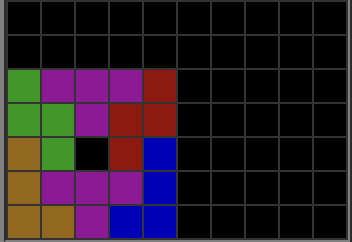

# LST volume math
by Kixenon (10th Feb 2026)

## Definitions
*   **Stack-side**: Columns 1–5 (1-indexed).
*   **Well-side**: Columns 6–10 (1-indexed).
*   **Default-LST**: LST without any "double-ups" or "quads".

---

## Default-LST:

Each bag of Default-LST, on average, will have 3 pieces used at the well-side (LJT or SZT shape) and 4 pieces used at the stack-side. *Pre-stacking or alts will reach this average in the limit, and thus can be ignored without affecting the math.*

Every 2 bags, the well-side raises by 5 height. This gives us an average of (2.5 height/bag).

Meanwhile, the stack-side increases by (4 pieces/bag) * (4 minos/piece) = (16 minos/bag). Over 5 columns, this raises the height by (16 minos/bag) / (5 minos/height) = (3.2 height/bag).

As you can see, Default-LST has a height-delta per bag of 2.5 - 3.2 = **-0.7**.

This means that every bag, the stack-side will accumulate 0.7 more rows than the well-side. If unresolved, you will quickly end up with an undesirable boardstate with no more space to place pieces. 

 *(Common LST-beginner 20TSD boardstate. Queue: IOLJZST -> you are cooked)*

---

## LST without quads:
Each double-up moves 2 pieces from the stack-side to the well-side.
The stack-side loses (2 pieces/double-up) * (4 minos/piece)  / (5 minos/height) = (1.6 height/double-up).

However, despite the same pieces being added to the well-side, there are actually +2 empty minos which cannot be filled, giving an effective gain of (2 height/double-up).

 *(Notice 2 added empty minos unclearable without quads)*

Thus, each double-up has a height-delta of 2 - (-1.6) = **+3.6**.

Consequently, **LST without quads** would require (3.6 height-delta/double-up) / (0.7 height-delta/bag) = **5.14285714286 bags/double-up**.

---

## LST with quads:
The excess volume we get from one TSD per bag is (7 pieces/bag) * (4 minos/piece) - (20 minos/TSD) * (1 TSD/bag) = (8 minos/bag). A quad requires 40 minos, which is once every 5 bags.

Each quad effectively only reduces one stack-side piece (the I itself), which is a height-delta per bag of only (4 minos/quad) / (5 column/height) / (5 bags/quad) = **+0.16**.

Hence, **LST with quads** would require (3.6 height-delta/double-up) / (0.7 height-delta/bag - 0.16 height-delta/bag) = **6.66666666667 bags/double-up**.